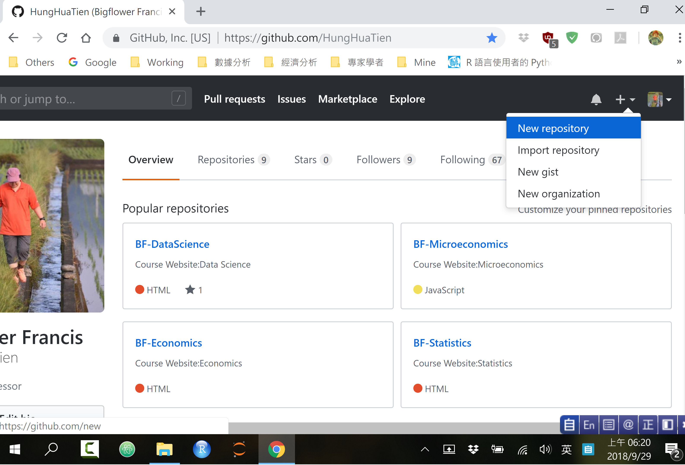

## Question: 如何上傳作業到自己的Github帳戶

[Demo Vedio](https://www.youtube.com/watch?v=fbCQBrjL2BA&feature=youtu.be)

～ Step 0: 請到Github<https://github.com/>申請一個使用帳戶。

- `Sign Up`註冊：請填寫個人基本資料。
- `Sign in`登錄：進入Github帳戶開始使用。

～ Step1: 在Github設立工作儲存空間

- 在菜單上面有個`+`號，請按`+`號後選擇`New repository`。

  

- 進入設立新工作儲存空間頁面(Create a new repository)，請依序輸入下面資訊：
	- 輸入`Repository name` (Introduction to Data Science)
	- 輸入`Description` (Course Homework)
	- 選擇`Public`
	- 勾選`Initialize this repository with a README`
	- 最後按`Create Repository`完成工作儲存空間設定。

  

～ Step2: 上傳作業檔案到Github工作儲存空間

- 在自己電腦桌面將要上傳的檔案準備好。
  - 子目錄Exercise，裡面放上課講義的指令實做檔案，檔案以`week-i.R`為檔名。
	- 子目錄Homework，裡面放課後作業，檔案以`homework-j.Rmd`為檔名。
	- 子目錄Project，裡面放期末報告相關檔案，包括資料檔(.csv)、程式檔(.R)與報告檔(.Rmd)。

- 在Github工作儲存空間Introduction to Data Science中
	- 選擇`Upload files`按鈕
	- 然後將電腦桌面子目錄與檔案直拖拉到網頁畫面中
	- 等電腦將所有檔案上傳完畢
	- 對上傳檔案輸入說明文字（Commit changes, Optional）
	- 按`Commit Changes `鍵完成檔案上傳作業

- **日後交作業時，請將作業與文件放到**Introduction to Data Science**的repository 中，一個子目錄叫Exercise，一個子目錄叫Homework，一個子目錄叫Project。**
