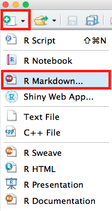
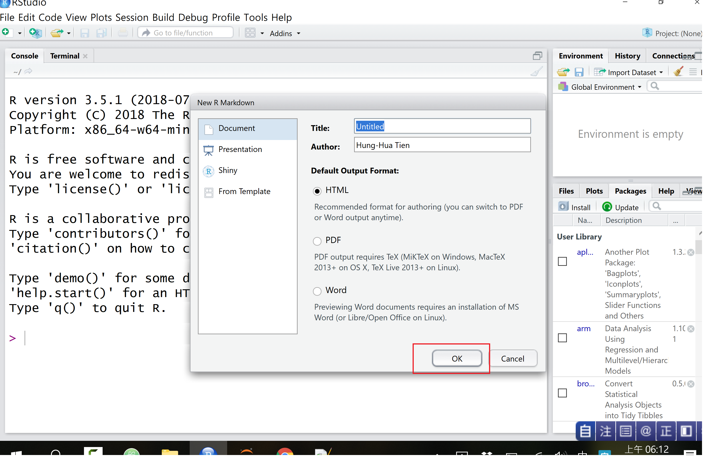
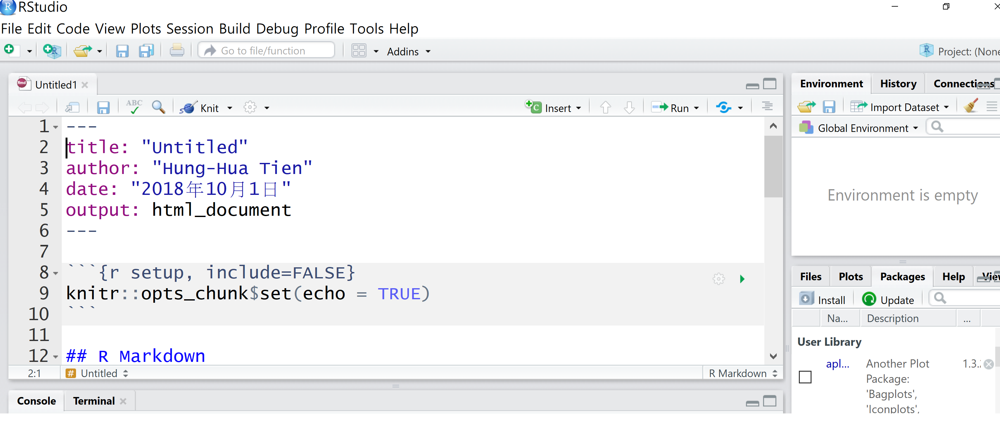
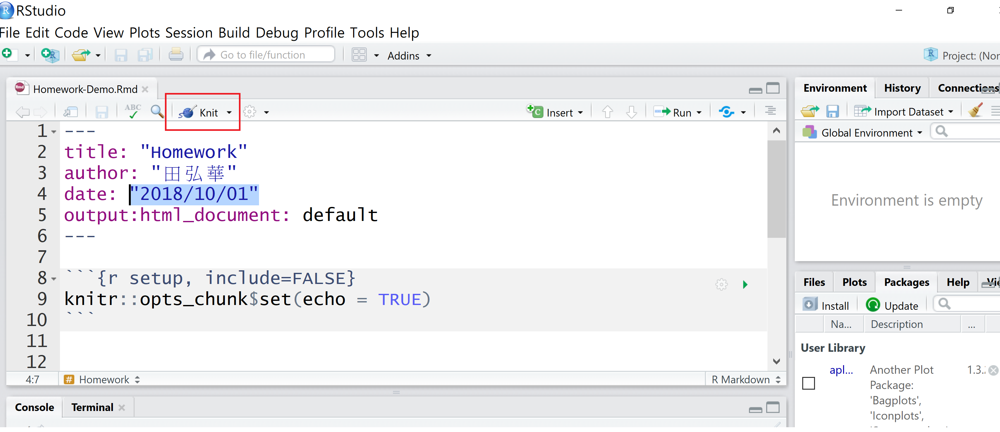

Question:如何建立Rmarkdown檔案交作業

 [影片示範操作](https://www.youtube.com/watch?v=t99r-1xuI-w)

**Step 1: 在 RStudio 的選單點選新增一個 R Markdown 文件**：

**Step 2: Rstudio的Rmarkdown範例**

- 如果是第一次新增 R Markdown 文件的使用者，RStudio 應該會出現提示訊息安裝 knitr 等相關套件，這時點選同意安裝就可以。
- 不用做任何修改，直接按OK。

- 新增完畢之後我們就會看到一個有範例說明的 R Markdown 文件。

- 一個Rmarkdown文件檔案(.Rmd)包含三部分:表頭、Markdown文件區塊、R程式區塊。

**Step 3: 請修改表頭。**

- 文件上方用 --- 區隔出來的區塊是這個文件的資訊，即表頭。
- 我們可以任意修改表頭的文件標題、作者名稱與製作日期。
	- 日期無中文字："2018/10/01"
- 若您的電腦有安裝 LateX 與 MS Word，則輸出格式可更改如下：
	- 輸出格式為 PDF 就改為 output: pdf_document。
	- 輸出格式為 MS Word 就改為 output: word_document。

**Step 4:請修改文件區塊與程式區塊。**

- 請將範例檔非表頭的地方全部刪除。
- **在文件區塊部分**，放入自己的文章或說明。
	- 可加上Markdown文件元素排版。
- **在程式區塊部分**，請注意頭尾的標示，並在旁邊加註 {r}，中間放程式碼。
	- 當程式區塊中的R程式被執行時，結果直接顯示在程式區塊的下方。
	- 因此，不需再仰賴其他文書編輯軟體整合文字、程式與結果。

**Step 5: 點選Knit按鍵準備輸出。**

- 目前這個檔案已經可以輸出，請點選 RStudio 選單的 Knit：

- 儲存 R Markdown 文件。
- 指定編碼格式，繁體中文通常用 UTF-8 (有時選BIG5 編碼）。

～方法二：直接修改範例檔案Homework-Demo.Rmd
